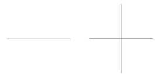
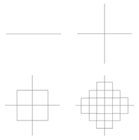

# Functions and Fractals: Practice Test

0. Assume `f(x) = 5 - x` and `g(x) = x * 2`. What are the results of
    - `f(8)`
    - `g(6)`
    - `g(g(3))`
    - `g(f(g(g(-1))))`


1. Identify the following parts of the given code:
    ```python
    def subtract_two(cal):
        return val - 2

    result = subtract_two(10)
    print(result)
    ```
    - The word that denotes a function is being created:
    - The name of the function:
    - The number of inputs to the function and their type(s):
    - What the function return type is:
    - The line that contains the function call: 

2. What is the type annotation for each of the following functions:
    - `input()`
    - `pendown()`
    - `len()`
    - `right()`
    - `pencolor()`

3. Create a function that takes three integer inputs and returns the sum of the
   two largest numbers.

4. Create a function that takes a two strings as an input and returns the first
   two letters of each string "concatenated" (aka, added) together. Then, create
   a function call for your function such that "hi" is printed out.

5. The recursive rules for the fractal below is for every straight line, go to
   the middle of the line and draw two lines that are half the original length
   to the right and left. The first two steps of the fractal are shown below.
   Create the next two levels.

   

6. What is the output of this recursive function?
    ```python
    def do_something(x):
        if len(x) < 2:
            print("All done")
        else:
            tmp = x[0] + x[-1]
            rest = x[1:-1]  # get everything but first and last character
            print(tmp)
            do_something(rest)

    do_something("computer")
    ```

7. What is the output of this recursive function?
    ```python
    def do_something(x):
        if len(x) < 2:
            print("All done")
        else:
            tmp = x[0] + x[-1]
            rest = x[1:-1]  # get everything but first and last character
            do_something(rest)
            print(tmp)

    do_something("computer")
    ```

# Answers
# On
# Next
# Page
# ....
# ....
# ....
# ....

0. Assume `f(x) = 5 - x` and `g(x) = x * 2`. What are the results of
    - `f(8)` -> `-3`
    - `g(6)` -> `12`
    - `g(g(3))` -> `12`
    - `g(f(g(g(-1))))` -> `18`

1. Identify the following parts of the given code:
    ```python
    def subtract_two(cal):
        return val - 2

    result = subtract_two(10)
    print(result)
    ```
    - The word that denotes a function is being created: `def`
    - The name of the function: `subtract_two`
    - The number of inputs to the function and their type(s): one `integer`
    - What the function return type is: `integer`
    - The line that contains the function call: `result = subtract_two(10)`

2. What is the type annotation for each of the following functions:
    - `input()` -> `str -> str`
    - `pendown()` -> `None -> None`
    - `len()` -> `str -> int`
    - `right()` -> `int -> None`
    - `pencolor()` -> `str -> None`


3. Create a function that takes three integer inputs and returns the sum of the
   two largest numbers.

   ```python
   def add_two_biggest(x, y , z):
    if x > y:
        if y > z:
            return x + y
        else:
            return x + z
    else:
        if x > z:
            return y + x
        else:
            return y + z
    ```

4. Create a function that takes a two strings as an input and returns the first
   two letters of each string "concatenated" (aka, added) together. Then, create
   a function call for your function such that "hi" is printed out.

   ```python
    def first_letters(s1, s2):
        return s1[0] + s2[0]

    print(first_letters("hola", "ice"))
   ```

5. The recursive rules for the fractal below is for every straight line, go to
   the middle of the line and draw two lines that are half the original length
   to the right and left. The first two steps of the fractal are shown below.
   Create the next two levels.

   


6. What is the output of this recursive function?
    ```python
    def do_something(x):
        if len(x) < 2:
            print("All done")
        else:
            tmp = x[0] + x[-1]
            rest = x[1:-1]  # get everything but first and last character
            print(tmp)
            do_something(rest)

    do_something("computer")
    ```
    - cr, oe, mt, pu, All done

7. What is the output of this recursive function?
    ```python
    def do_something(x):
        if len(x) < 2:
            print("All done")
        else:
            tmp = x[0] + x[-1]
            rest = x[1:-1]  # get everything but first and last character
            do_something(rest)
            print(tmp)

    do_something("computer")
    ```
    - All done, pu, mt, oe, cr
